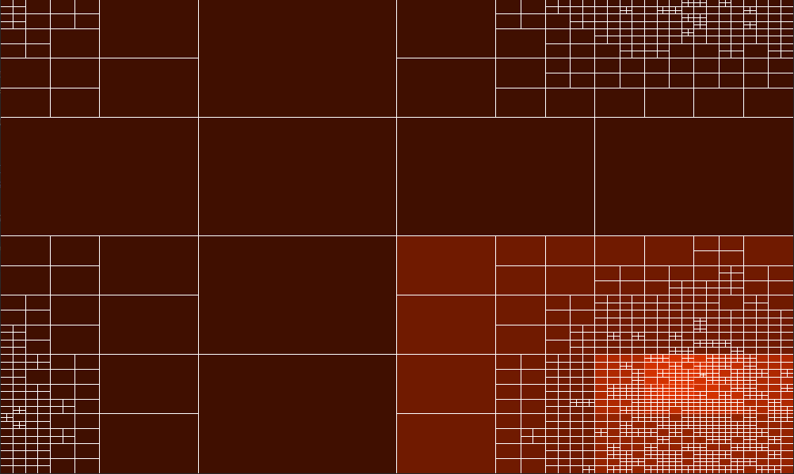

# Quad Tree

Simple point-region quadtree visualization

Made using [Rust SFML](https://github.com/jeremyletang/rust-sfml)

## Buttons

* P - Pause
* T - Toggle drawing tree
* V - Toggle drawing vertices
* H - Toggle searched node highlighting